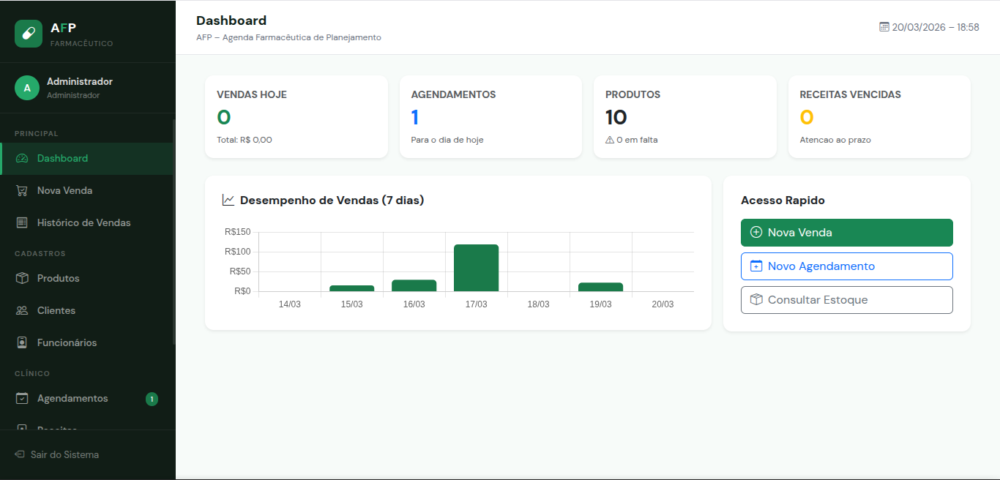
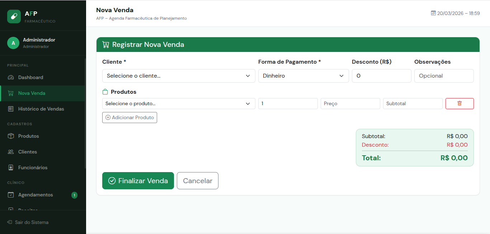
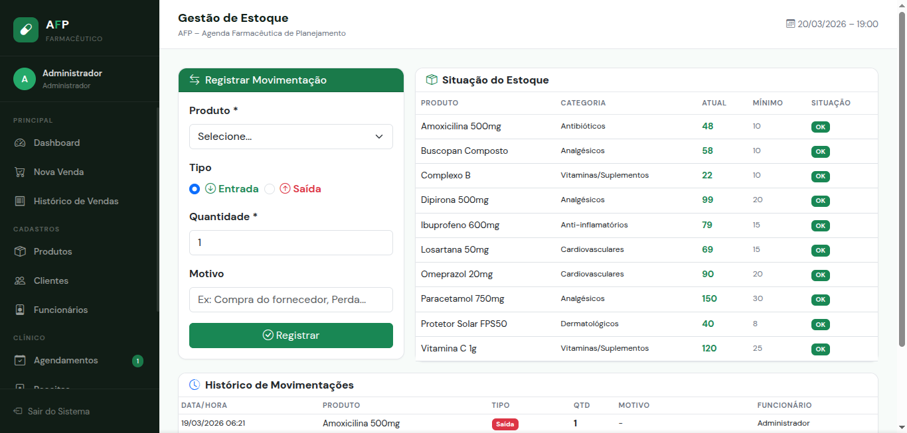
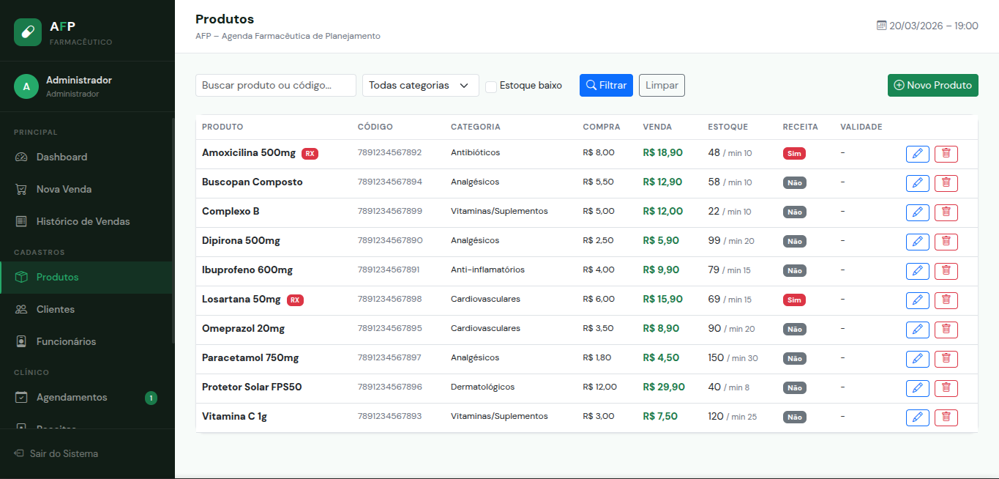
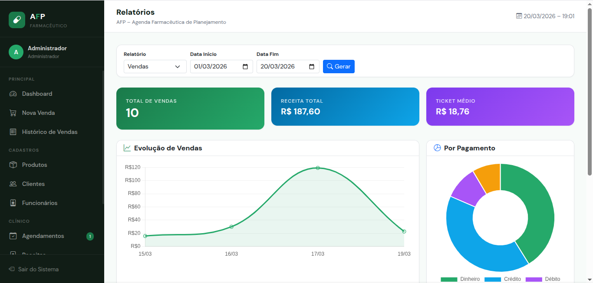

# 💊 AFP — Sistema de Gestão Farmacêutica

> Sistema web completo para gestão de farmácias, com controle inteligente de estoque, vendas, clientes, agendamentos clínicos e relatórios gerenciais.


---

## 🚀 Demonstração

🔗 **Sistema online:** [Abrir sistema](http://cacau.byethost6.com/login_afp.php)

👤 **Usuário:** `teste`  
🔒 **Senha:** `1234`

---

## 📸 Preview do Sistema

### 📊 Dashboard
<p align="center">
  
</p>

### 💰 Vendas
<p align="center">
  
</p>

### 📦 Estoque
<p align="center">
  
</p>

### 🛍️ Produtos
<p align="center">
  
</p>

### 📈 Relatórios
<p align="center">
  
</p>

---

## ⚙️ Funcionalidades

### 📊 Dashboard
- Indicadores de vendas e receita diária
- Agendamentos do dia
- Alertas de estoque baixo e receitas vencidas
- Gráfico de desempenho (últimos 7 dias)
- Acesso rápido às principais funcionalidades

### 💰 Vendas
- Registro de vendas com múltiplos produtos
- Aplicação de desconto por venda
- Formas de pagamento: Dinheiro, Débito, Crédito e PIX
- Atualização automática do estoque
- Histórico completo com filtros

### 📦 Produtos e Estoque
- Cadastro com código de barras, categoria e validade
- Controle de estoque mínimo com alertas
- Registro de movimentações (entrada/saída)
- Identificação de produtos com retenção de receita (RX)

### 👥 Clientes
- Cadastro completo (CPF, telefone, e-mail, endereço)
- Busca rápida por nome ou CPF

### 📅 Agendamentos
- Serviços: pressão, glicemia, injetáveis, curativos, etc.
- Controle de status: Agendado, Concluído, Cancelado, Faltou
- Filtros por data e status

### 📜 Receitas Médicas
- Vinculação com paciente e médico (CRM)
- Controle de validade automático
- Status: Válida, Vencida, Cancelada

### 📈 Relatórios *(restrito)*
- Vendas por período e forma de pagamento
- Produtos mais vendidos
- Ranking de clientes
- Relatórios de agendamentos

---

## 🛠️ Tecnologias

- **Backend:** PHP 7.4+
- **Banco de dados:** MySQL / MariaDB
- **Frontend:** HTML, CSS, Bootstrap 5.3
- **Scripts:** JavaScript
- **Gráficos:** Chart.js
- **Ícones:** Bootstrap Icons

---

## 🔐 Controle de acesso
O sistema possui controle de permissões por cargo:

| Cargo         | Funcionários | Relatórios | Demais páginas |
|---------------|:------------:|:----------:|:--------------:|
| Administrador | ✅           | ✅         | ✅             |
| Gerente       | ✅           | ✅         | ✅             |
| Farmacêutico  | ❌           | ✅         | ✅             |
| Atendente     | ❌           | ❌         | ✅             |
| Auxiliar      | ❌           | ❌         | ✅             |

> As permissões são validadas em tempo real no servidor.

---

## ⚙️ Instalação e execução

### 1. Banco de dados
- Crie um banco no MySQL
- Importe o script SQL do projeto

### 2. Configuração
Crie um arquivo `config.php` com suas credenciais:

### 3. Execução
- Utilize um servidor local (XAMPP, Laragon ou WAMP)
- Acesse o projeto via navegador:
  http://localhost/afp-sistema-gestao-farmaceutica

```php
define('DB_HOST', 'seu_host');
define('DB_NAME', 'seu_banco');
define('DB_USER', 'seu_usuario');
define('DB_PASS', 'sua_senha');
```
---

## 📄 Licença

Este projeto está sob a licença MIT.
